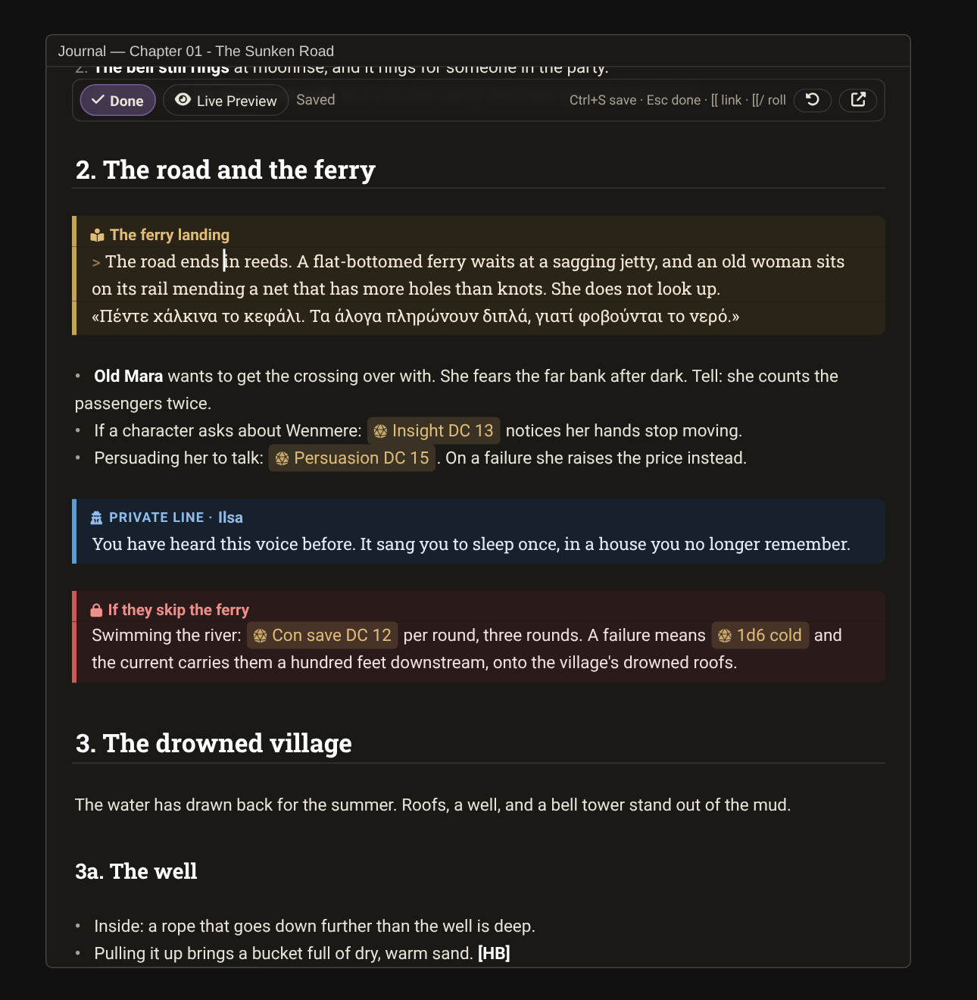
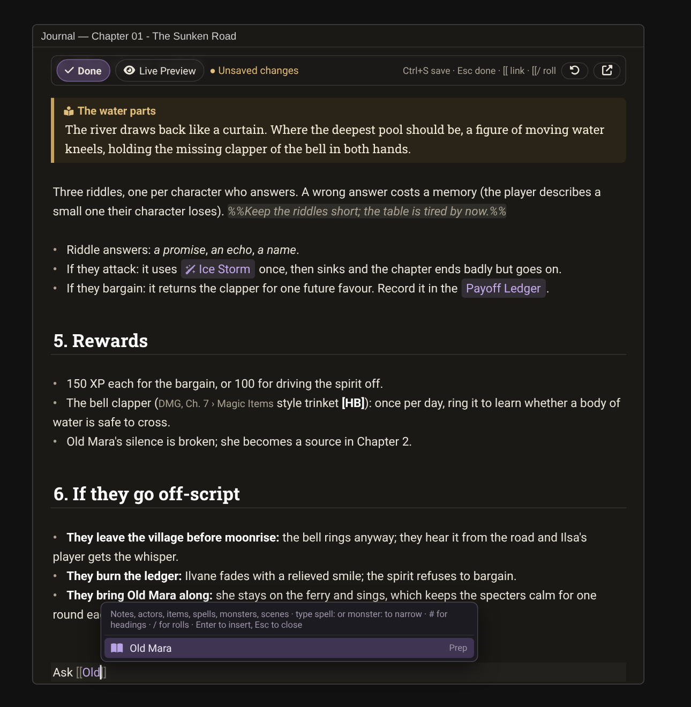

# Planar Codex

Run your tabletop campaign from your Obsidian notes, inside Foundry VTT.

Import an Obsidian vault once. Every note becomes a Markdown journal page in a **Codex** folder that mirrors the vault. From then on you read, edit and link your notes in Foundry, roll dice and show read-aloud text to players straight from them, and export changed notes back to the vault when you want the files current.



- **Your Obsidian syntax works**: `[[wikilinks]]` with headings and aliases, embeds, callouts, `%%comments%%`, `==highlights==`, tasks, frontmatter.
- **Edit where you read**: double-click a paragraph and it becomes an Obsidian-style Live Preview editor at that spot.
- **Link Foundry documents by name**: `[[actor:…]]`, `[[spell:Fireball]]`, `[[monster:…]]`, with autocomplete for notes, world documents and dnd5e 2024 compendiums.
- **Run the table from the note**: roll buttons, *Show to players* and *Post to chat* on read-aloud boxes, private lines whispered to one player, revealable secrets.
- **GM-only material stays GM-only**: players get a stored version of each note without DM boxes, private lines or comments.

Built for Foundry VTT v14. Most features work in any game system; roll helpers and compendium autocomplete use the dnd5e system when it is active. Greek and other non-Latin text is fully supported (the editor ignores accents when matching).

## Install

In Foundry: **Add-on Modules → Install Module**, paste this into **Manifest URL**, and install:

```
https://github.com/zacharatos/planar-codex/releases/latest/download/module.json
```

Then enable **Planar Codex** in your world's module settings.

## Use

Journal sidebar (GM only) → **Import vault**, **Export vault**, **New note**.

- **Import vault:** choose the vault folder; untick folders you don't want (folders named Sources, Tools, `.obsidian` and similar start unticked). Only images that notes embed (`![[image.png]]`) are uploaded, to `worlds/<world>/planar-codex/`. Re-running the import adds new notes and updates notes you haven't edited in Foundry; notes changed on both sides follow the conflict choice. A report lists dangling and ambiguous links.
- **Edit in place:** the note turns into an editor right where you are reading, and turns back into the note when you're done, at the place you stopped.
  - **Double-click** a paragraph, list item, table row or callout: the cursor lands on that line.
  - **Pencil** next to any heading (hover it): edit from that heading.
  - **Edit** button at the top of the note, **Ctrl+E**, or Foundry's own edit control: edit from whatever is at the top of the window.
  - **Live Preview**, like Obsidian: Markdown markers stay hidden and links, rolls, tasks and callouts look as they do when reading, until the cursor reaches them. Ctrl+/ (or the mode button) switches to plain Markdown source.
  - **Keys:** Ctrl+S save · Esc or Ctrl+E done (saves) · Ctrl+B bold · Ctrl+I italic · Ctrl+Shift+H highlight · Ctrl+K wrap in `[[ ]]` · Ctrl+F find · Ctrl+Z undo. Enter continues lists, tasks and callouts. Ctrl+click a link opens it.
  - Edits save when you press Done/Esc or Ctrl+S, and automatically if the note leaves the screen with unsaved changes (window closed, page turned). Players keep seeing the last saved version while you type.
  - The ↗ button opens Foundry's own editor window instead; Settings → Planar Codex can turn off in-place editing or double-click.
- **Links, rolls, autocomplete** (in both editors):
  - Type `[[` and a few letters: a list offers notes (by name or alias, Greek accents ignored), world actors, items, scenes, tables, playlists and macros, and dnd5e 2024 spells, monsters and equipment. Enter or Tab inserts the link, Esc closes the list.
  - Narrow it with a prefix: `[[spell:`, `[[monster:`, `[[actor:`, `[[item:`, `[[scene:`, `[[table:`.
  - `[[Note#` lists that note's headings; `[[#` lists this note's own.
  - `[[/` offers roll buttons (check, save, damage, heal, attack, dice): pick one, fill in a small form, and the dnd5e enricher is written for you.
  - Dragging an actor, item or scene in still works; dragging a Codex note inserts `[[Note]]`.


- **Text size:** Configure Settings → Planar Codex → Codex text size (per computer).
- **Export vault:** downloads a zip of the notes changed since import (or all), with the vault's folder layout. Unzip it over the vault.

## Syntax

| You want | Write |
| --- | --- |
| Link a note | `[[Note]]`, `[[Note\|label]]`, `[[Note#Heading]]`, `[[#Heading]]` (same note) |
| Show a note inline | `![[Note]]` or `![[Note#Heading]]` |
| Image | `![[picture.png]]`, `![[picture.png\|400]]` |
| Link a world or compendium document by name | `[[actor:Brannoc]]`, `[[monster:Flesh Golem]]`, `[[spell:Fireball]]`, `[[item:Silver Eagle Greatsword]]`, `[[scene:…]]`, `[[table:…]]`, `[[playlist:…]]` |
| Link by id (what drag and drop writes) | `@UUID[Actor.abc123]{Brannoc}` |
| Dice | `[[/r 2d6+3]]`, `[[/gmr 1d20]]`, `[[1d20]]` |
| dnd5e checks, saves, damage | `[[/check skill=his dc=15]]`, `[[/save ability=dex dc=18]]`, `[[/damage 8d10 fire average]]`, `[[/heal 2d4]]`, `[[/attack +5]]`, `&Reference[prone]` |
| Read-aloud box (Show to players / Post to chat buttons) | `> [!readaloud] Optional title` then `> text` |
| Private line for one player (Whisper button) | `> [!whisper] Ilsa` then `> text` |
| GM-only box (never sent to players) | `> [!dm] Optional title` then `> text` |
| Secret (revealable) | `> [!secret]` then `> text` |
| GM-only aside | `%%like this%%` |
| Highlight | `==text==` |
| Task (ticks in Foundry, saved to the note) | `- [ ] thing` |

Other Obsidian callouts (`[!note]`, `[!warning]`, `[!tip]` …) render as coloured boxes; add `-` or `+` after the type to make one collapsible.

### Frontmatter the module reads

```yaml
---
type: npc            # free text; shown in the properties box
aliases: [Brannoc, Μπράνοκ]   # other names [[links]] can use
tags: [tavern]
actor: Brannoc         # the Foundry actor this note is about
player: Ilsa Varn   # handouts: adds a "Share with Ilsa Varn" button
visibility: players  # imported as visible to all players (default: GM only)
codex-import: false  # leave this note out of the import
---
```

## What players see

The page's stored HTML is the player version: `[!dm]` and `[!whisper]` boxes, `%%comments%%` and frontmatter are left out entirely. Only the GM view renders them, from the Markdown. Notes import as GM-only unless `visibility: players` is set.

## Settings

| Setting | Scope | What it does |
| --- | --- | --- |
| Codex folder | world | Name of the journal folder that holds imported notes |
| Show backlinks | world | Lists the notes that link to a note at the bottom of the GM view |
| Citation prefixes | world | Inline code starting with one of these (`PHB, Ch. 7 › Fireball`) shows as a small book reference |
| Autocomplete in the editor | per computer | `[[` suggestions |
| Codex text size | per computer | Body text size of Codex notes |
| Edit notes in place | per computer | Foundry's edit control opens the in-place editor instead of a window |
| Double-click to edit | per computer | Double-click a paragraph to edit it |

Keybinding: *Configure Controls → Planar Codex → Edit the note here* (Ctrl+E by default).

## Contributing and development

See [docs/DEVELOPMENT.md](docs/DEVELOPMENT.md) for the code layout, tests and the browser harness, and [docs/PUBLISHING.md](docs/PUBLISHING.md) for how releases are made. Issues and pull requests are welcome.

## Licence and credits

MIT, see [LICENSE](LICENSE). Bundles [CodeMirror 6](https://codemirror.net/) and [marked](https://marked.js.org/), both MIT.

Planar Codex is an independent project. It is not affiliated with or endorsed by Obsidian (Dynalist Inc.), Foundry Gaming LLC, or Wizards of the Coast. It ships no game content.
